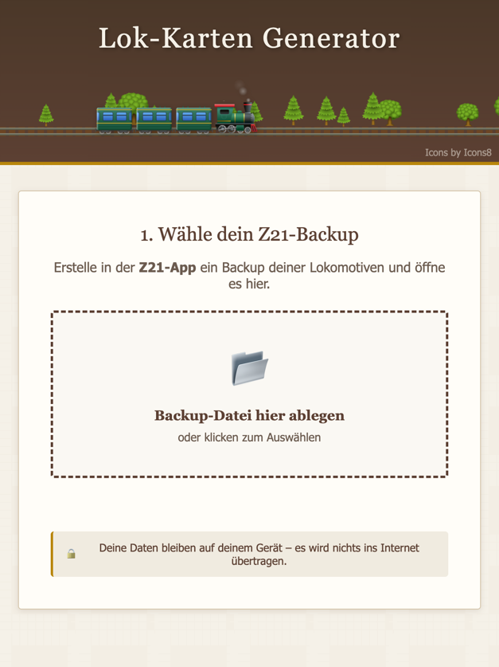

# Lok-Karten Generator

🇬🇧 [English](README.en.md) | 🇳🇱 [Nederlands](README.nl.md) | 🏛️ [Latina](README.la.md)

Ein Browser-basiertes Tool zum Erstellen von Lok-Karten aus Z21-Backups für Modellbahn-Enthusiasten.

**[▶ Online nutzen](https://donderda.github.io/z21ToCards/)**

## Features

- **100% Browser-basiert** – Keine Server-Installation nötig, alle Daten bleiben lokal
- **Z21-Backup Import** – Öffne dein Z21-App Backup (.z21 oder .zip)
- **Anpassbare Karten** – Größe, Farben, Schriftgröße und Adressen-Stil
- **PDF-Export** – Drucke deine Karten auf A4, A3 oder 10x15cm
- **Gedruckt-Markierung** – Behalte den Überblick, welche Loks bereits gedruckt wurden
- **Einstellungen speichern** – Deine Konfiguration wird im Browser gespeichert
- **Mehrsprachig** – DE, EN, NL (und Latein), automatische Erkennung der Browsersprache

## Verwendungsmöglichkeiten

Die gedruckten Karten eignen sich perfekt für:
- **Magnetkarten** – Ausdrucken und auf Magnetfolie kleben, z.B. für eine Magnetwand oder Whiteboard
- **Laminierte Karten** – Für langlebige Handkarten beim Fahren
- **Übersicht am Fahrpult** – Alle Lok-Adressen auf einen Blick

## Nutzung

### Online
Nutze die **[gehostete Version auf GitHub Pages](https://donderda.github.io/z21ToCards/)** oder öffne die `public/index.html` lokal im Browser.

### GitHub Pages

1. Fork dieses Repository
2. Gehe zu **Settings → Pages**
3. Wähle **GitHub Actions** als Source
4. Die App ist dann unter `https://<username>.github.io/z21ToCards/` erreichbar

## Technologie

- Vanilla JavaScript (keine Frameworks)
- [sql.js](https://github.com/sql-js/sql.js/) – SQLite im Browser via WebAssembly
- [JSZip](https://stuk.github.io/jszip/) – ZIP-Dateien im Browser entpacken
- [jsPDF](https://github.com/parallax/jsPDF) – PDF-Generierung im Browser

## Erweiterbarkeit

Der Code ist so strukturiert, dass zukünftig weitere Backup-Formate (z.B. TrainController, ECoS) unterstützt werden können. Siehe `backupParsers` in `script.js`.

## Datenschutz

Alle Daten werden ausschließlich lokal in deinem Browser verarbeitet. Es werden keine Daten an Server übertragen.

## Icons

Zug- und Baum-Icons von [Icons8](https://icons8.com).

## Lizenz

MIT
